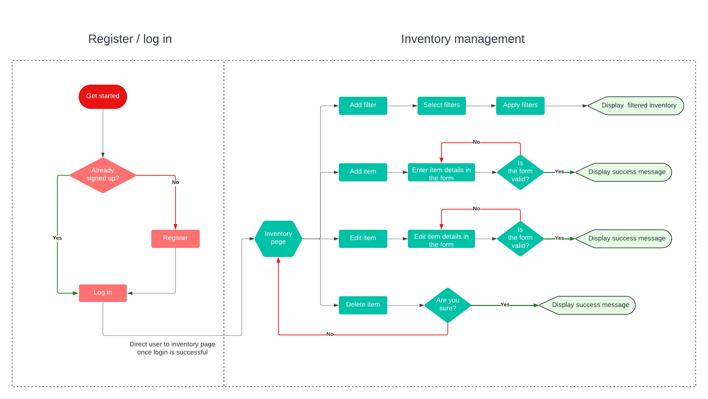
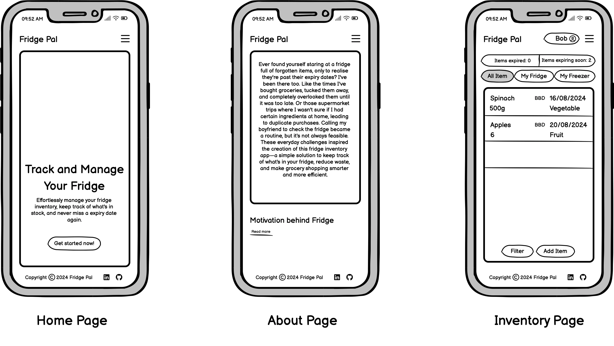

#  ridge Pal

### A Fridge Inventory Management Website

Ever found yourself staring at a fridge full of forgotten items, only to realise they're past their expiry dates? I've been there too so many times. These everyday challenges inspired the creation of Fridge Pal inventory website — a simple solution to keep track of what's in your fridge, reduce food waste, make grocery shopping smarter and more efficient.

==Add responsive design screenshot here==
== Visit the live site here (add the heroku link) ==

*This is the final personal capstone project with Code Institute.*

## Table of Contents

- [ User Experience (UX) ](#user-experience-ux)
- [ Agile Project Management ](#agile-project-management)
- [ Features Implemented ](#features-implemented)  
- [ Future Features ](#future-features)  
- [ Technologies Used ](#technologies-used) 
- [ Validation & Testing ](#validation--testing)  
- [ Bugs ](#bugs)  
- [ Deployment ](#deployment)
- [ Resources ](#resources)  
- [ Credits & Acknowledgements ](#credits--acknowledgements)

## User Experience (UX)

### UX Design

#### Overview

The fridge inventory website is designed to help users efficiently manage and track the contents of their fridge. By organizing items based on name, quantity, location, category, and expiry dates, the app aims to reduce food waste, save money, and ensure that users are always aware of what they have on hand. The app offers intuitive features like notifications for expiring items and easy categorization to enhance the user experience.

#### Target User Base

- **Home Cooks and Families**: Individuals or families who cook regularly and need to keep track of their groceries and leftovers. They want to reduce waste, save money, and ensure they always have fresh ingredients available.
- **Health-Conscious Users**: People focused on healthy eating who want to track the freshness and quality of their ingredients. They might also want to categorize items by dietary preferences, such as gluten-free, vegan, or organic.
- **Busy Professionals**: Users with hectic schedules who often forget what's in their fridge, leading to expired food. They need a quick and efficient way to manage their fridge inventory and receive reminders when items are about to expire.
- **Eco-Conscious Consumers**: Individuals who are concerned about food waste and want to make sure they use all the food they purchase. They are motivated by sustainability and environmental impact.

#### User Requirements

1. **Simple Item Addition and Removal**:
- Users should be able to add items to the inventory easily.
- The website should allow quick updates to item quantities as users consume or purchase more of an item.
2. **Categorization and Filtering**:
- Users should be able to categorise items into groups such as dairy, vegetables, meats, etc.
- The website should allow filtering by category, expiry date, or quantity to quickly find specific items.
3. **Expiry Date Notifications**:
- The website should notify users when items are expired.
- The website should notify users when items are approaching their expiry date, allowing them to prioritise usage.
4. **Inventory Overview and Insights**:
- A dashboard that provides a clear overview of the fridge's contents.
- Visual aids like icons (e.g., water droplet for fridge; snow flakes for freezer) can be used to help users quickly know whether the item is in the fridge or freezer compartment.

#### Goal

**Reduce Food Waste**:
The primary goal of the website is to help users minimise food waste by keeping track of what’s in their fridge and using items before they expire. This aligns with both economic savings for the user and environmental sustainability.

**Improve Organization and Efficiency**:
By providing a clear and organized view of fridge contents, the website aims to make meal planning, grocery shopping, and cooking more efficient. Users should spend less time searching for ingredients and more time focusing on meal preparation.

**Encourage Sustainable Living**:
The website’s long-term goal is to encourage users to adopt more sustainable living practices by being mindful of food consumption and waste. Through features like recipe suggestions based on existing items (*this is a potential feature for future development*) and expiry notifications, the website supports a lifestyle that is both eco-friendly and cost-effective.

### User Flow Diagram

A simple user flow diagram was created to map out the logical path a user takes when interacting with the website. This diagram illustrates the process of user registration and login before accessing the inventory functionality, as well as the potential actions a logged-in user can take on the inventory (dashboard) page.


### Wireframe

Balsamiq Wireframes was used to create the wireframe which serves as a guide for the User Interface design of Fridge Pal website.

#### Laptop - Home Page


#### Laptop - About Page


#### Laptop - Inventory Page


#### Phone


### Database Planning
##### [ Back to Top ](#table-of-contents)

## Agile Project Management
In developing my fridge inventory web app, I adopted Agile methodology to ensure flexibility, continuous improvement, and efficient project management. The use of Agile allowed for iterative development, enabling me to frequently reassess and adjust the project scope. Central to this approach was the utilization of a Kanban board on GitHub Projects.
My Kanban board can be viewed here: **ADD LINK HERE**
### Kanban Board Overview
I used the Kanban Board to track user stories, bugs needs to be fixed, manage tasks, and visualise the project’s progress in real-time.
My Kanban Board consists of the following sections:

- **Backlog**: This section contains all the tasks and user stories that were planned to be implemented. Tasks are ordered with the highest priority at the top.
- **Implementation In Progress**: Work in progress was tracked here. Tasks in this section are focused solely on the implementation of functionalities.
- **Styling In Progress**: This section tracks tasks where the functionalities have been completed, and styling is needed.
- **Done**: Tasks that were completed successfully were moved to this column and closed.
- **Future Features**: Features that were not implemented during this iteration and will be tackled in the future.

### User Stories Overview
User stories were instrumental in shaping the design of my Fridge Pal website by ensuring that every feature aligned with user requirements. Each user story was carefully crafted with specific acceptance criteria and associated tasks, providing a clear roadmap for development. By mapping these user stories onto the Kanban board, I was able to prioritize tasks effectively and ensure that the design process remained focused on delivering a user-centric experience.

### List of User Stories
**User Authentication**
- [User registration](https://github.com/CrazyEggz/ci-fridge-pal/issues/1)
- [User login](https://github.com/CrazyEggz/ci-fridge-pal/issues/2)
- [User logout](https://github.com/users/CrazyEggz/projects/4/views/1?query=sort%3Aupdated-desc+is%3Aopen&pane=issue&itemId=74778503)

**Inventory Management**
- [Add Items to the Inventory](https://github.com/CrazyEggz/ci-fridge-pal/issues/4)
- [Edit an Item in the inventory](https://github.com/CrazyEggz/ci-fridge-pal/issues/5)
- [Delete an item from the inventory](https://github.com/CrazyEggz/ci-fridge-pal/issues/6)
- [View all the items in the inventory](https://github.com/CrazyEggz/ci-fridge-pal/issues/7)
- [Search items in the inventory](https://github.com/CrazyEggz/ci-fridge-pal/issues/8)
- [Display expiry date information](https://github.com/CrazyEggz/ci-fridge-pal/issues/13)

**Notification & Alerts**
- [Display success messages](https://github.com/CrazyEggz/ci-fridge-pal/issues/12)
- [Highlight items when the best-before date is near](https://github.com/CrazyEggz/ci-fridge-pal/issues/9)

**About Fridge Pal**
- [Brief introduction about Fridge Pal](https://github.com/CrazyEggz/ci-fridge-pal/issues/3)


##### [ Back to Top ](#table-of-contents)

## Features Implemented
##### [ Back to Top ](#table-of-contents)

## Future Features
##### [ Back to Top ](#table-of-contents)

## Technologies Used
##### [ Back to Top ](#table-of-contents)

## Validation & Testing
##### [ Back to Top ](#table-of-contents)

## Bugs
##### [ Back to Top ](#table-of-contents)

## Deployment
### Deployment with Heroku
Fridge Pal was developed locally in Gitpod, with frequent commits pushed to the GitHub repository. This project was deployed to Heroku, which integrates well with GitHub for continuous deployment. The deployment steps can be summarised as below:

1. Create a database in [Code Institute CI](https://dbs.ci-dbs.net/). (**Note**: If you are not a Code Institute student, setup a Postgres or another Django-compatible database elsewhere)
2. Clone the repository.
3. Create an `env.py` file with the following file contents (fill in the `<...>` fields):
```python
import os

os.environ["DATABASE_URL"] = "<YOUR DATABASE URL>"
os.environ["SECRET_KEY"] = "<A RANDOMLY GENERATED SECRET KEY>"
os.environ["DEBUG"] = "1"

```
> [!CAUTION]
> `en.py` file contains sensitive information. Make sure not to push it.

4. Run `pip3 install -r requirements.txt` to install the dependencies.
4. Run `python3 manage.py migrate` to initialise your database.
5. Run `python3 manage.py createsuperuser` to create a superuser.
6. Login to Heroku and create a new deployment.
7. Connect the Heroku app to your GitHub repo
8. Create the following configuration variables (DO NOT CREATE `DEBUG`. This is not safe on a production environment):
- DATABASE_URL
- SECRET_KEY
9. Click the "Deploy" button to deploy the app
  
##### [ Back to Top ](#table-of-contents)

## Resources
##### [ Back to Top ](#table-of-contents)

## Credits & Acknowledgements
##### [ Back to Top ](#table-of-contents)
